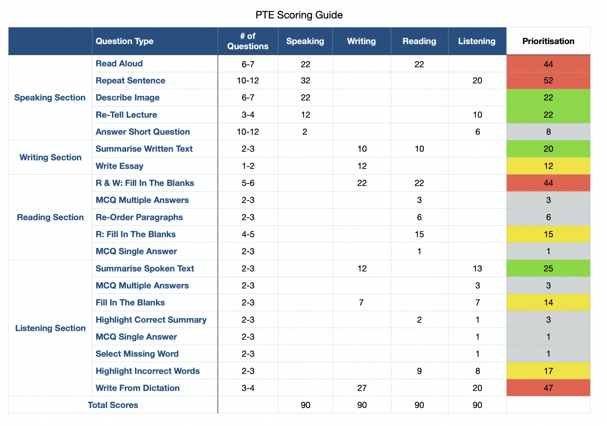

##Three parts
1. Speaking+Writing **60min**
2. Reading **30min**
3. Listening **35min**

### Parts and Scores

Specifications
# Speaking
### Read Aloud
6-7 questions **very important**

60 words approx & 35 seconds to prepare & 35 seconds to speak

fluency & pronunciation & content have equal importance

* Fluency means a smooth speed. No hesitations and self-corrections
* Content means don't omit words eg. s ed at the end of the words
* pronunciation means speaking clearly, regardless of accent

### Repeat Sentence
10-12 questions **very important**

**30-35 tasks practice every day**

9-16 words long & immediate start after the questions

fluency & pronunciation & content have equal importance

the same criteria as above

**tips**: make a content rather than stop

eg: I am going to London with my friends to attend a birthday party

if I miss the "attend a birthday party" just free style to make it "I am very happy"

### Describe Image

3-4 questions **important**

25 seconds to prepare & 40 seconds to response **(20-30s ideal)**

fluency & pronunciation & content have equal importance

the same criteria as above

Will have an image(line, pie, rand pic)

**tips**: just need some key word in the image, there is no fixed answer.

> This (picture/pie chart/line chart/flow chart) gives information about: **(title)**.
>
> To begin with, there are few elements, for example **(1)**.
>
> Firstly, the most important information is **(2)**, which indicates **(3)** is very critical.
>
> Secondly, another important information is **(4)**, which means **(5)** is very vital.
>
> In conclusion, this (picture/pie chart/line chart/flow chart) gives information about **(6)**, which is very useful/informative.

### Retell Lecture

1-2 questions **important**

40-90s audio may or may not have pictures|videos & 10 seconds to prepare & 40 seconds to response **(*(25-35s ideal)*)**

fluency & pronunciation & content have equal importance

the same criteria as above

**tips**: grammar & repetition & vocabulary are not important. Ideally, need 15 keywords

> The speech was mainly about **论点**.
>
> First of all, the speaker mentioned that **分论点1**.
>
> Secondly, he also pointed out **分论点2**.
>
> In the end, the author points out that **让步/论点3**, it also needs to ensure that **重复论点**.
 
### Answer Short Question 

5-6 questions **not important**

immediate start after the questions

**tips**: right answer > repeat all options > repeat keywords in question
just 1-3 words is ok

# Writing
### Summarise Written Text

1-2(ideal) questions **important**

100-300 words paragraph & 10 minutes time & 5-75 words to summarise but only in one sentence

2min for reading & 6min for writing & 2min for checking

content & grammar+spelling & vocabulary > form

**tips**:
>1. ten minutes for each task, no rollover time, make use of whole time 
>2. for content: needs 7 more keywords from the passage. Can use words/phrase from the passage

### Writing Essay 

1(ideal)-2 questions **important**

write 200-300 words essay (250ideal ) & 200 minutes time 

content & form & grammar & spelling & vocabulary & logistic & linguistic range

**tips**:
1. Can have aggree/disaggree, problem-solution, discussion essay
2. 1 min read+think + 16 min write + 3 min proofread 
3. focus on no mistake not the ideas

# Reading
total question 13-18;  Total time 29-30min; Overall time; if click next cannot come back

### Reading and Writing Blanks (Dropdown blanks)
5-6 paragraph **very important**

4 option to choose 1 based on grammar and context

**tips**:
1. 2min max for a paragraph
2. fill the sure blanks sure at first
3. do not leave unattempted

### Reading Blanks (Drag and Drop)

4-5 questions **important**

a paragraph with 4-5 blanks and 7-8 options at the bottom

**tips**:
(2min max per passage)
1. understand the context first
2. fill the sure one first

### Reading Reorder Paragraph

5-6 questions **not important**

4-6 sentences and sort them

**tips**:
(1min max per task)
1. Find an independent sentence
> generally have (introduce the topic & general idea about something & introduce specific noun)
> generally not have (He/She/It & Firstly/However & short form)
2. Find the following sentence

### MCQ Multiple Answers
5-6 questions **not important**

normally 5-7 options half of them are correct

**tips**:
1. 1min max for a paragraph
2. +1 for right, -1 for wrong 
3. select one if not sure

### MCQ Single Answers
2-3 questions **not important**

**tips**:
(1min max per passage)

##Listening
total question 12-20;  Total time 30-43min; Overall time(section 1(only summarise spoken text) & 2 in seperate time); if click next cannot come back.

# Listening
### Summarise Spoken Text

1-2 questions **important**

audio 40-90 seconds & 10 minutes each & summarize in 50-70 words

content & form & grammar & spelling & vocabulary have equal importance

tips:
1. content: mention main point as well as 5-7 keywords
2. form: 50-70 words (65 ideally).
3. 1 for introduction, includes the main topic of the lecture 10-15words
4. 2-3 for body, keywords 30-40words.
5. 1 for conclusion, includes the final conclusion or suggestion 10-15words

> The main focus of the lecture was **(Topic)**. A number of advantages/disadvantages/effects/causes of **(Topic)**.
> The first crucial aspect revealed in the discourse was **(Idea1)**.
> Furthermore, another significant/noteworthy point mentioned in the lecture was **(Idea2)**
> Additionally, the lecture also exhibited important information about **(Idea3)**
> In conclusion, the lecture suggested that **(Conclusion)**

### MCQ Multiple Answer
1-2 questions **not important**

audio 30-90s & 5-7options

tips:
1. go through the title before the audio is ready
2. focus on the meaning before keywords
3. 10-20 seconds after audio

### Fill in the Blanks
2-3 questions **important**

audio 30-60s & each have 4-5 blanks

tips: 
1. have the eye on the screen while writing notes
2. proper nouns including particular person, place, organization with a capital letter
3. 30-40s to typpe

### Highlight Correct Summary
1-2 questions **not important**

audio 35-90s & right answer summarize the audio

tips:
1. take notes to record the story
2. eliminate the wrong options
3. 30-40s to choose

### MCQ Single Answer
1-2 questions **not important**

audio shorter than MCQ multiple & 4 options

tips:
1. 10s to choose

### Select Missing Words
1-2 questions **not important**

audio 30-60s & last few words are missing & 5-7 options to choose

tips:
1. under the context the positive/negative
2. note down the last words -> eliminate the answer in grammar
3. not sure -> go with the lecture topic

### Highlight Incorrect Words
2-3 questions **important**

audio 30-60s & transcript of the lecture also available & highlight incorrect words & 4-5 incorrect words(generally)

tips:
1. words with similar pronunciation
2. no a/an/the incorrect
3. move on when the audio stop

### Write from Dictation
3-4 paragraph **very important**

audio with 8-16words & type exactly as you hear it

tips:
1. keep repeating the sentences
2. write the words/initials of the sentence
3. 50s to type
4. Spelling, Proper noun, first word and punctuation

## suggested everyday practice
|task|numbers|
|----|----|
|Read Aloud|20|
|Repeat Sentences|30|
|Reading and Writing Blanks|20|
|Reading Reorder Paragraphs|10|
|Reading Blanks (drag and drop)|20|
|Summarize Spoken Text|2|
|Listening Fill in the Blanks|10|
|Listening Highlight Incorrect Words|5|
|Write from Dictation|30|

